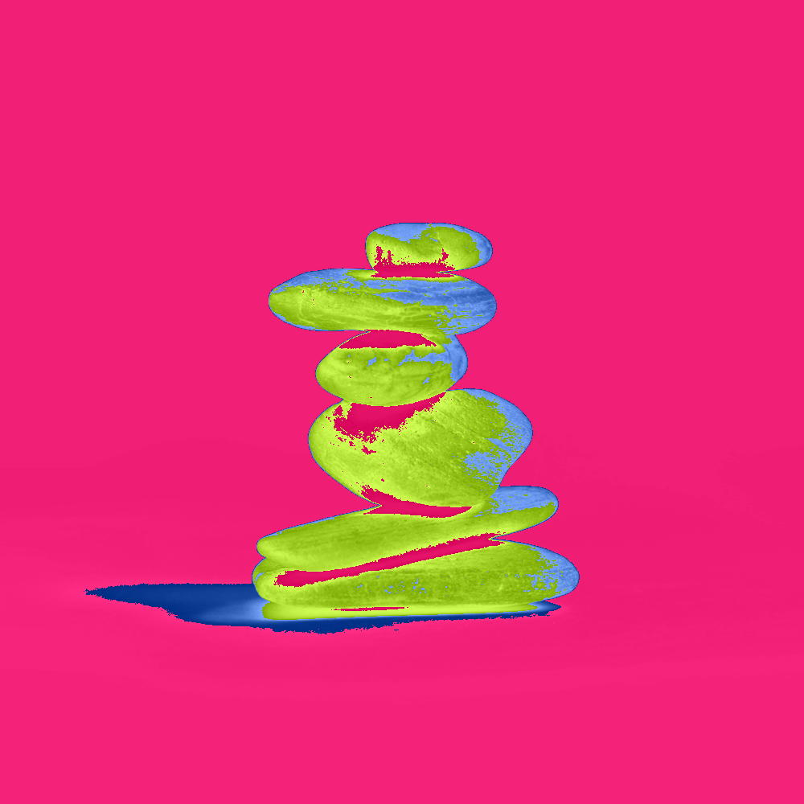

# Càrn

[![License: AGPL-3.0]](LICENSE)

**A self-hosted git forge.** Repos, issues, and pull requests.
Server-rendered HTML, public by default, no passwords.

## Documentation

- [Build plan](docs/PLAN.md)
- [Layout study](docs/LAYOUT.md)
- [Brand book](docs/BRAND.md)

## License

AGPL-3.0. See [LICENSE](LICENSE).

## Acknowledgements

- The logo is a photo by [Nicolas Solerieu], creatively altered to fit
  Càrn's brand language
- Càrn's UI/UX was inspired by [Zentto Design Studio]
- The theme colors coalesced around [Blushing Schoolgirl]

[Blushing Schoolgirl]: https://www.colourlovers.com/color/E7156C/Blushing_Schoolgirl
[License: AGPL-3.0]: https://img.shields.io/badge/license-AGPL--3.0-E7156C?style=flat-square
[Nicolas Solerieu]: https://unsplash.com/photos/a-stack-of-rocks-sitting-on-top-of-each-other-7AM9xVtFlZ0
[Zentto Design Studio]: https://minimal.gallery/zentto-design-studio/
